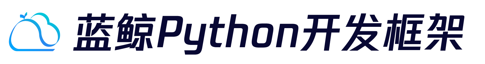

# 蓝鲸Python开发框架Blueapps

   

> **重要提示**: `master` 分支是开发分支，可能处于 *不稳定或者不可用状态* 。请通过[releases](https://github.com/TencentBlueKing/blueapps/releases) 而非 `master` 去获取稳定的软件包

蓝鲸Python开发框架Blueapps可以帮助开发人员快速在蓝鲸 PaaS 平台上开发 SaaS 的 `Python 框架` 。该开发框架基于 `Django 框架` 架构，并在此基础上进行扩展，增加蓝鲸系统的特有功能，例如：`身份验证`、`ESB 调用` 及 `模板渲染` 等功能，以便开发者可以更专注于 SaaS 的 `逻辑开发` 。

 本次开源的是蓝鲸Python开发框架Blueapps打包编译环境，执行打包构建后开发人员可以直接基于源码提供的功能进行开发。

## Overview

- [快速开始](docs/overview/project_usage.md)
- [代码目录](docs/overview/project_codes.md)
- [使用说明](https://bk.tencent.com/docs/document/6.0/130/5949)

## Roadmap

- [版本日志](docs/release.md)

## Support

- [蓝鲸论坛](https://bk.tencent.com/s-mart/community)

- 联系我们，技术交流QQ群：

  社区版QQ交流群：495299374
  
  蓝鲸运维开发交流群：878501914
  
  
  
  

## Contributing
对于项目感兴趣，想一起贡献并完善项目请参阅[Contributing Guide](docs/CONTRIBUTING.md)。

[腾讯开源激励计划](https://opensource.tencent.com/contribution) 鼓励开发者的参与和贡献，期待你的加入。

## FAQ

请查看 [FAQ](docs/faq.md)

## License

基于 MIT 协议， 详细请参考[LICENSE](LICENSE.txt)

